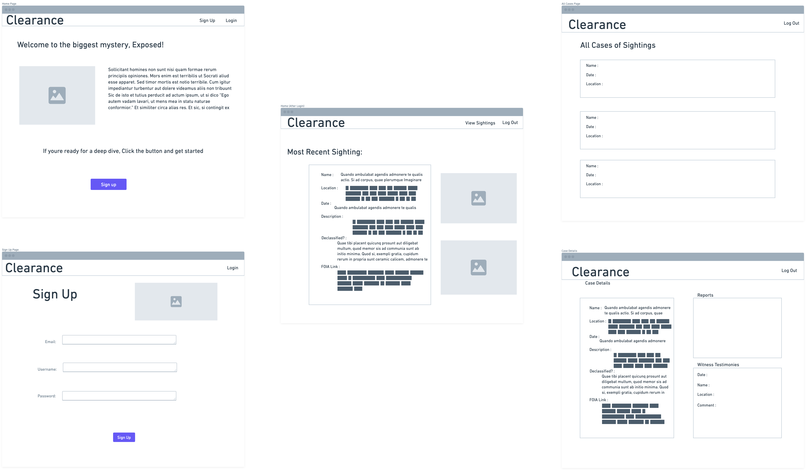

## **CLEARANCE**
#### _Earth's Best Verified Database of Documented UAP/UFO Encounters_

#### Written by Brian Cherchiglia, Nicholas Emmons & Platin Syla
#### Published by  **[~~CLASSIFIED~~]** 
#### Created on June 15, 2023
***
***

#### [**GitHub**](https://github.com/cherch173/clearance)
#### [**Pitch Deck**](https://docs.google.com/presentation/d/19VvCpuwiEPfkocKGqwoLBUTidVhzyIa0D_IitGpcXZQ/edit?usp=sharing)
#### [**Trello Board**](https://trello.com/b/2BknXJri/clearance)
***
***
### _**Description**_
Years ago, we would have scoffed at the idea too. 

However...in light of current events, validated, vetted testimonials, declassified government cables & documents _and_ confirmed UAP Footage captured by high-ranking military officials (well-regarded by many as the most trusted observers in the world) it's become clear that in this era of true UFO/UAP/NHI Disclosure: we need a refined, **organized**, database of all proven UAP Encounters across the globe.

**CLEARANCE** is that service.

Split into individual CASES -- we at _Clearance_ have devised a simple, accesible, user-friendly web based application to handle the maelstrom of information that's come our way since Leslie Kean & Ralph Blumenthal first published their article in the _New York Times_ in 2017 confirming the existence of AATIP (the _Advanced Aerospace Threat Identification Program_) within the United States' Department of Defense.

Turns out the truth _is_ out there and well, it'd sure be a lot easier to access if it was a bit more user-friendly...
***

### _**Concept**_
Using **Django** as our framework and **Python** as our language -- we can structure our application to just a few Data MODELS.

We'll also be utilizing the built-in styling of **Materialize** to implement **CLASS BASED VIEWS** -- extending our BASE TEMPLATE throughout our application creating a comfortable, easily transferable design.

The **database** will be stored and accessed using **PostgreSQL**.

For **Images**, we'll store them using an S3 Bucket in AWS (Amazon Web Services), and for **User Authentication** we'll use DJANGO'S built-in authentication service in conjuction with AWS' IAM feature.

***
***
### _**Technologies**_
- Python
- PostgreSQL
- Django
- S3 + AWS + Neon
***
***

## _**Getting Started**_
To talk about (and witness) difficult things, simplicity and accessibility is crucial.

The design element has to provide a sense of comfort, and will largely be homogenous thanks to **Materialize**.

We'll stick to _Business Logic_ and keep our MODELS fairly light.

Each Model will have the following criteria:

**CASES**
- name = charField()
- location = charField()
- date = dateField()
- description = textField()
- declassified = booleanField()
- foia_link = charField()

**REPORTING (News Reports)** (One to Many)
- D = Documentaries
- I = Internet Only
- N = Newspaper
- P = Press Conference
- T = Television

**COMMENTS (Witnesses)** (One to Many)
- date = dateField()
- name = charField()
- comment = textField()

Each MODEL will have CRUD capabilities.

We'll also utililiza SHOW Functionality to bring an INDEX & DETAILS view for each CASE.

**Images, Authentication & Authorization** will be achieved through using **S3 & AWS**.
***
***
## _**WIREFRAME**_

***
***

## _**ERD**_

***
***

## _**PROJECT FLOW**_

- **THURSDAY**
    - [X] Project Conceptualization   
    - [X] Outlining MODELS and their One to Many & Many to Many Relationships    
    - [X] Trello Board   
    - [X] Wireframe   
    - [X] ERD   
    - [X] ReadME   
    - [X] Pitch Deck
          
- **FRIDAY**
    - [X] Merge Branches to Brian's (Main)
    - [X] Create DATABASE     
    - [X] Build DATABASE
    - [X] Use django-admin to build architecture
    - [X] Use python3 manage.py startapp main
    _app to build main_app
    - [X] .gitignore
    - [X] Configure DATABASE
    - [X] Migrate before start
    - [X] Create HOME Page
    - [X] Create ABOUT Page
    - [X] CASES urls
    - [X] CASES views
    - [X] CASES templates
    - [X] Create All CASES Page
    - [X] Make All CASES Page Display All CASES and their ATTRIBUTES
    
- **SATURDAY**
    - [X] IMPORT DB into ORM SHELL and CRUD new CASES
    - [X] Test CRUD Functionality
    - [X] Create ADMIN Portal
    - [X] Create CASE DETAILS Page (Show Functionality)
    - 
- **SUNDAY**
    - [X] Implement CLASS BASED VIEWS
    - [X] 5 Steps for CREATE (New Functionality) CASE
    - [X] Create TEMPLATE FORM for CREATING CASE
    - [X] Create CASE UPDATE & CASE DELETE using the 5 Steps
    - [X] Add REPORTING (News) MODEL
    - [X] Migrate
    - [X] Add REPORTING (News) to ADMIN PORTAL
    - [X] Display all REPORTS for CASE
    - [X] Add NEW REPORT (News) Functionality using the 5 Steps
    - [X] Add Materiliaze's JS Library
    - [X] Add Custom Method for Reporting Status (Popularity)

- **MONDAY**
    - [X] Begin MANY to MANY MODEL for TESTIMONIALS (witness reports)
    - [X] Add the ability to CRUD within the MANY to MANY MODEL
    - [X] Ensure MANY to MANY renders on the CASE Detail Page
    - [X] create .env to protect ACCESS KEY
    - [X] Begin S3 + AWS Process
    - [X] create ACCESS KEY ID & SECRET ACCESS KEY
    - [X] create S3 Bucket for App
    - [X] install boto3
    - [X] ADD a PHOTO MODEL
    - [X] ADD the PHOTO ROUTE (url)
    - [X] ADD the add_photo VIEW FUNCTION
    - [X] Update UI on DETAIL PAGE to SHOW PHOTOS
    - [X] Add PHOTOS to ADMIN PORTAL
    - [X] Begin Django AUTHENTICATION
    - [X] DEFINE USER -< CASE Relationship
    - [X] Add URLS for Auth
    - [X] Logging In / Logging Out
    - [X] Update the Nav Bar to be Dynamic
    - [X] Update CaseCreate View to Link to a User
    - [X] Make sure only LOGGED IN USER can view CASES
    - [X] Implement Authorization

- **TUESDAY**
    - [X] Debug
    - [X] Stylizing
    - [X] Systems Tests
    - [X] Deploy bb
***
***
 
***
***
### _**Credits**_
#### **IMAGES USED**
##### USS Nimitz Tic Tac UAP Gif -- [New York Times](https://static01.nyt.com/images/2017/12/19/autossell/STILL2/STILL2-articleLarge-v2.gif?quality=75&auto=webp&disable=upscale)
##### USS Omaha UAP Gif -- [NBC News](https://static01.nyt.com/images/2017/12/19/autossell/STILL2/STILL2-articleLarge-v2.gif?quality=75&auto=webp&disable=upscale)
##### Mosul ORB Gif -- [Jeremy Corbell](https://nypost.com/wp-content/uploads/sites/2/2023/04/chrome-capture-2023-3-21.gif?w=1024)

##### FLIR US Navy Gif -- [Giphy](https://media2.giphy.com/media/kgaDUlwMxDfKZUK5hy/200.gif?cid=6c09b952ln5iq8n7i018r0j2ryt1w5hzazctlrc7yq611ive&ep=v1_gifs_search&rid=200.gif&ct=g)
